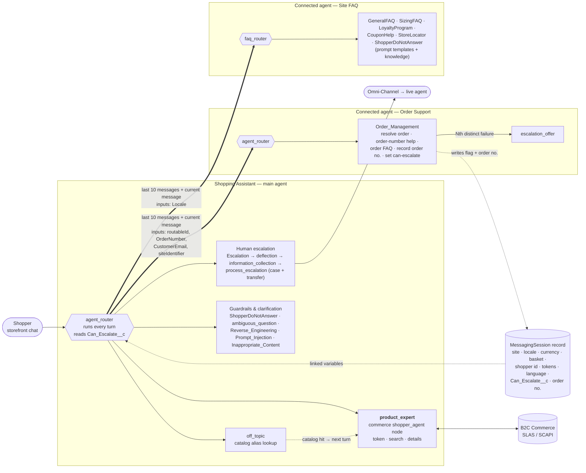
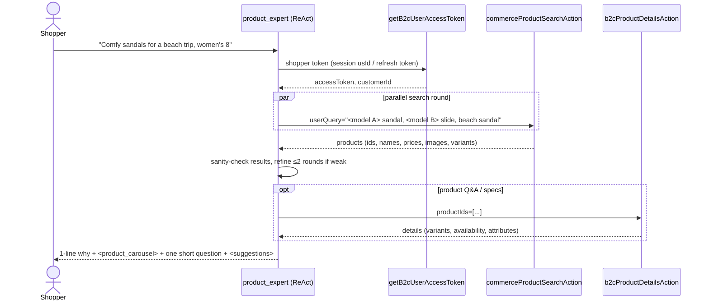
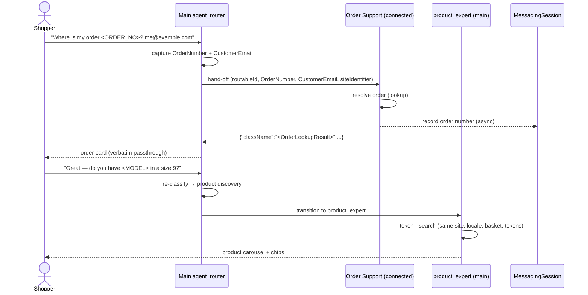
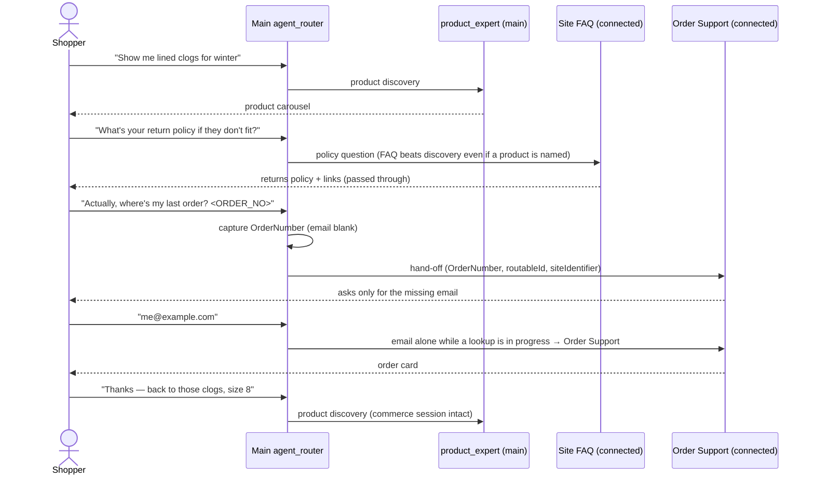

# Agentforce Shopper Agent with Connected Service Agents — Reference Architecture

> **Purpose:** This is a reusable pattern for a B2C Commerce shopper agent that combines product
> discovery, run by a commerce subagent in the main agent, with order support and site FAQ, run by
> separately deployed **connected agents**. It also covers live‑agent escalation, how context is
> shared across agent boundaries, and how a shopper moves seamlessly between service and commerce.
>
> The pattern is taken from a production‑style retail deployment and has been anonymised. Names in
> `<ANGLE_BRACKETS>` are placeholders. Standard Salesforce action and node names are real.

---

## 1. Overview

From the shopper's point of view, there is one assistant with one persona and one voice. Underneath,
it is a network of agents:

* **Main agent (Shopping Assistant).** It owns the conversation, the per‑turn router, all
  commerce, the guardrails, and the hand‑off to a human.
* **Internal subagents.** These are topics defined inside the main agent's script and run in the
  main agent's context.
* **Connected subagents.** These are separate, independently deployed Agentforce agents that the
  main agent calls through `@connected_subagent`. Each has its own script, router, actions, prompt
  templates, agent user, and variable store. Service teams can own and release them independently of
  the commerce team.

| Layer | Component | Type | Responsibility |
|---|---|---|---|
| Entry | `agent_router` (start_agent) | Router (`sfdc_ai__DefaultEinsteinHyperClassifier`) | Runs on every shopper turn and picks the destination |
| **Commerce** | **`product_expert`** | **Commerce node `node://commerce/shopper_agent/v1`** (BYON LLM) | Product discovery, recommendations, comparisons, and product Q&A (features, specs, price, availability, variants, product‑specific sizing) |
| Commerce helper | `off_topic` | Internal subagent + Apex catalog‑alias lookup | Checks unfamiliar or misspelled words against the catalog, then hands off to `product_expert` |
| Clarification | `ambiguous_question` | Internal | Multi‑topic or vague requests |
| Guardrails | `ShopperDoNotAnswer`, `Reverse_Engineering`, `Prompt_Injection`, `Inappropriate_Content` | Internal | Medical, competitor, PII, checkout‑in‑chat, and safety refusals |
| Escalation | `Escalation` → `deflection` / `phone_assist` → `information_collection` → `process_escalation` | Internal | Deflect, count requests, collect name and email, create a case, transfer |
| Close | `EndSession` | Internal | `@utils.end_session` |
| **Service** | **`<Order_Support_Agent>`** | **Connected agent** `agent://<Order_Support_Agent>` | Order status, tracking, return or refund status, return eligibility for a specific order |
| **Service** | **`<Site_FAQ_Agent>`** | **Connected agent** `agent://<Site_FAQ_Agent>` | Site and service policy FAQ, size chart, loyalty program, coupon how‑to, store locator |
| Human | `connection messaging` | Omni‑Channel Flow `flow://<Service_Router_Flow>` | Live‑agent transfer |

---

## 2. Architecture diagram



---

## 3. How routing works

1. **Every shopper message enters `agent_router` first.** This includes messages sent while the
   conversation is "inside" a connected agent. The router reclassifies intent on each turn and uses
   recent conversation history only to make sense of short follow‑ups such as "yes", "the first one",
   or "check another order". This per‑turn routing is what lets a shopper switch freely between
   service and commerce (see Section 6).
2. **Deterministic pre‑checks run before the LLM classifier.** They run in this order:
   * Seed `siteId` and `userLocale` from MessagingSession‑linked variables.
   * Run `Read_Session_Context` (a flow that reads `Can_Escalate__c`, which the connected Order Support
     agent may have set).
   * If `CanEscalate` and `escalationRequested` are both true, go to `information_collection`.
   * If escalation information collection is in progress, go to `information_collection` or
     `process_escalation`.
   * If a catalog typo confirmation is pending, go to `off_topic`. If a catalog hand‑off is pending,
     go to `product_expert`.
3. **LLM routing rules** decide between the remaining destinations:
   * Profanity or extreme frustration goes to escalation.
   * A request for a human goes to `Escalation`.
   * Medical, competitor, PII, and checkout‑in‑chat requests go to `ShopperDoNotAnswer`.
   * **Questions about a specific order** go to **Order Support**. These include status, tracking,
     eligibility, refund or return status, a bare order number, and cancelling or changing a named order.
   * **Policy and process questions** go to **Site FAQ**. These include how to return or exchange
     when no order number is given, shipping, warranty, care, size chart, loyalty, coupon how‑to,
     store locator, and the general process for cancelling an order.
   * **Product discovery and product attribute questions** go to `product_expert`.
   * Unfamiliar or misspelled single words go to `off_topic` for a catalog check.
   * Questions that span several topics or are vague go to `ambiguous_question`.

> **Design tip:** The single most important routing boundary is *policy vs. product*. "What's the
> return policy on these sandals?" is FAQ, even though it names a product. "Does model X run big?" is
> product, because it is about a specific product's sizing. State this boundary explicitly in the
> router and in both subagent descriptions.

---

## 4. Product Expert subagent (commerce)

`product_expert` is the commerce workhorse. It handles **all product discovery and product
questions**: browsing, searching, recommendations, comparisons, gift or outfit bundles, and questions
about a specific product's features, specs, price, availability, variants, and sizing. It does
**not** handle policy, care, order status, or the general size chart. The router sends those to the
connected agents.

### 4.1 How it is built

It is not a hand‑written topic. It is the **Salesforce commerce shopper node**, configured through
parameters:

```text
subagent product_expert:
    schema: "node://commerce/shopper_agent/v1"
    parameters:
        template:
            model:                 @variables.byon_model                # BYON model via LLM gateway
            topic:                 "shopper_agent_freeform_react"       # node prompt template id (do not change)
            retailer_name:         @variables.retailer_name
            retailer_description:  @variables.retailer_description      # brand + catalog knowledge
            retailer_voice:        @variables.retailer_voice
            tool_calling_guidance: @variables.tool_calling_guidance     # HOW to search
            response_guidance:     @variables.response_guidance         # HOW to answer / format
            example_response:      @variables.example_response          # few-shot example
            id_col:                "id"
            include_processed_response: False
            allowed_components:    ["product_carousel", "suggestions"]
```

The node renders a fixed prompt from these parameters:

* **Identity** comes from `retailer_name`, `retailer_description`, and `retailer_voice`.
* **How you work** is a ReAct loop.
* **Available components** are filtered by `allowed_components`.
* **Critical rules** come from the node itself.
* **Retailer‑specific guidance** comes from `response_guidance`.
* **Example response** comes from `example_response`.

### 4.2 ReAct loop



1. The node receives the shopper message and the conversation history.
2. It **reasons**, then emits `<tools>` to call one or more tools. Independent searches run **in
   parallel** in a single round.
3. It reads the tool results and either loops back (refine, fetch details) or stops.
4. It produces the final response: short Markdown prose plus UI components. The response must end
   with `<suggestions>`.

### 4.3 Tools (actions)

| Tool | Standard action | Key inputs (from main‑agent variables) | Used for |
|---|---|---|---|
| `GetB2CUserAccessToken` | `standardInvocableAction://getB2cUserAccessToken` | `authNamedCredential`, `siteId`, `usId` (session), `refreshTokenLinked`, `sfraAuthTokenLinked` | Gets a SLAS shopper token tied to the shopper's storefront session. Its outputs `accessToken`, `customerId`, and `sfraAuthToken` are stored in main‑agent variables and reused by the other tools. |
| `CommerceProductSearch` | `standardInvocableAction://commerceProductSearchAction` | `userQuery` (LLM‑filled, **comma‑separated multi‑query**), `orgId`, `siteId`, `userLocale`, `storeCurrency`, `configTemplate`, `queryFacets`, `authToken`, `customProperties` | Discovery, recommendations, and **comparisons**. It returns product IDs, names, prices, images, and variants, which feed `<product_carousel>`. |
| `GetB2CProductDetails` | `standardInvocableAction://b2cProductDetailsAction` | `productIds` (LLM‑filled), `fieldMask`, `imageViewType`, `orderableOnly`, `apiVersion`, `shopperApiNamedCredential`, `expressPaymentUrl`, `useSfraApi`/`sfraNamedCredential`, `messaging_session_id` | Answers questions about a specific product: specs, materials, variants and sizes in stock, price, and availability. |

Configuration notes:

* **`configTemplate`** points to a *Shopping Agent Config* custom metadata record. That record
  selects the product‑search source and other search settings.
* **`queryFacets`, `additionalRefinements`, `storeCurrency`, `userLocale`, and `siteId`** come from
  the MessagingSession, which the storefront widget populates. Search therefore respects the
  shopper's current site, locale, and currency.
* **`fieldMask`** limits the size of the details payload, for example by excluding long descriptions
  and extended data and capping images. This keeps the LLM context small and fast.
* **`orderableOnly = True`** makes the agent recommend only products that can be bought.
* **`customProperties`** (optional) adds selected `c_*` attributes, such as sale flags or ratings, to
  search results.

### 4.4 The four guidance layers

The node's behaviour is tuned almost entirely through variables. The table below shows what each one
controls and the patterns that proved effective in this deployment.

| Layer | What it controls | Effective patterns |
|---|---|---|
| `retailer_description` | Brand and **catalog knowledge** | <ul><li>A **catalog search cheat sheet** mapping product lines to their purpose.</li><li>A **need → keyword** map (occasion → model names).</li><li>A **trend → keyword** map (shopper slang → catalog words).</li><li>Licensed or character franchises.</li><li>A **fit and sizing guide** per line (runs large or small, half‑size advice).</li><li>**Audience by line** (women's‑only, kids'‑only, unisex).</li></ul> |
| `tool_calling_guidance` | **How to search** | <ul><li>Expand vague adjectives into concrete product words.</li><li>Pass **several comma‑separated queries** per call, ordered specific → broad.</li><li>Search the franchise or character name alone first.</li><li>**Sanity‑check results** and treat off‑target hits as a failed search.</li><li>Reformulate and refine at most about 2 rounds, and never declare "doesn't exist" after one empty search.</li><li>Split multi‑item requests into parallel component searches.</li><li>Answer **comparisons through search, not details**, so the UI components stay compatible.</li></ul> |
| `response_guidance` | **How to answer and format** | <ul><li>1–2 sentences of prose, with a one‑line "why" above each carousel.</li><li>Only mention products returned by a tool, and show every product named in a carousel.</li><li>Carry earlier preferences (colour, size, audience) forward across turns.</li><li>**Footwear gate:** ask for audience and size before showing shoes, using a **size‑ladder chip** set per audience plus a "different size" chip.</li><li>Fit notes on lines with a fit skew.</li><li>Category cross‑sell chips, for example accessories for a compatible product.</li><li>**Chip hygiene:** only offer chips the agent can fulfil. No cart or checkout, how‑to, colour, or "go back" chips.</li><li>An add‑to‑cart request gets a fixed deflection to the carousel or product page.</li><li>No code fences, raw JSON, or labels.</li></ul> |
| `example_response` | Few‑shot example | One worked example of a good search plan and response |

> **Implementation constraint:** Agent Script rejects any sentence or element over **255
> characters** in these list variables, and the same limit applies to variable descriptions. Split
> long rules into "…" and "… cont." strings. `sf agent validate` does not catch this; publish does.

### 4.5 UI components

`allowed_components = ["product_carousel", "suggestions"]`. In this deployment the agent
deliberately does **not** render `<product_tile>`, `<product_comparison>`, or `<cart>`:

* Comparisons are answered with a `<product_carousel>` ordered best‑fit first, plus a short
  explanation.
* There is no cart management in chat. The shopper adds to cart from the carousel or the product
  page.
* Every response ends with `<suggestions>` (next‑step chips phrased in the shopper's own voice).

To enable in‑chat cart management, add `cart` to `allowed_components`, add the cart actions, and set
`isCartMgmtSupported` on the session. Then remove the add‑to‑cart deflection rules from
`response_guidance`.

### 4.6 Getting a turn to Product Expert: catalog hand‑off

Short or unfamiliar words, such as a model name, a collaboration, a misspelling, or a product line
named after a city, are easy to misroute. The pattern sends them to `off_topic` first:

1. `off_topic` calls an **Apex catalog‑alias lookup** backed by Platform Cache, using the shopper's
   exact message.
2. **Exact hit:** it sets `catalog_handoff_pending = true`. On the *next* turn, the router's
   deterministic pre‑check moves the shopper to `product_expert`. Waiting a turn avoids an orphaned
   tool message that the commerce node cannot replay.
3. **Fuzzy (typo) hit:** it asks "Did you mean …?" and sets `awaiting_typo_confirmation = true`.
   * If the shopper says yes, the conversation goes to `product_expert`.
   * If the shopper says no, the agent politely redirects.
4. **Miss:** it redirects as off‑topic.

### 4.7 Model and runtime settings

* **Model:** BYON through the LLM gateway (`byon_model`), for example a GPT‑4.1‑class model. The
  routers use the Einstein Hyper Classifier for fast, low‑cost classification.
* `additional_parameter__disable_groundedness: True` and `disable_citation: True` are set on the
  main agent. Grounding comes from tool results, and citations come from the FAQ agent.

---

## 5. How context is shared between the main agent and the connected agents

A connected agent runs in **its own variable store**. It does **not** inherit the main agent's
variables. Its `linked` variables bound to `@MessagingSession.*` also resolve to **null** when it
runs as a connected agent, because the session binding is not inherited. Context therefore moves
through the five channels described below.

### 5.1 Channel 1: conversation history (main → connected)

Every time the main agent hands a turn to a connected agent, the runtime sends the connected agent
**one message** that bundles recent conversation history with the shopper's current message:

```text
[CONVERSATION HISTORY]
<last 10 messages>

[MESSAGE]
<user's last message>
```

* **`[CONVERSATION HISTORY]`** holds the **last 10 messages** of the conversation, from both the
  shopper and the assistant. It includes turns handled by the main agent, such as earlier product
  discovery, and by any other connected agent. The connected agent can therefore resolve short
  follow‑ups ("yes", "that one", "what about the other order?") and refer to anything mentioned in
  that window.
* **`[MESSAGE]`** holds the shopper's current message, which is the turn the connected agent must
  answer.

What this means for design:

* **History is unstructured text, and the window is limited.** Anything said more than 10 messages
  ago is not visible. Product IDs, carousel data, the basket, and tokens are never included, because
  only message text is sent.
* **Use history for conversational context. Use inputs (Channel 2) for anything an action needs.**
  If a connected agent's action must receive a value such as an order number, a session ID, a site,
  or a locale, pass it as an explicit input instead of relying on the model to find it in history.
  Explicit inputs are deterministic, survive beyond the 10‑message window, and do not depend on the
  model's extraction.
* **Write connected‑agent instructions with the envelope in mind.** For example: "Answer the
  `[MESSAGE]`. Use `[CONVERSATION HISTORY]` only to resolve references. Never answer an older
  question from the history."

### 5.2 Channel 2: explicit input mapping (main → connected)

The main agent declares `inputs:` on each `connected_subagent`. At hand‑off, these inputs fill the
connected agent's variables marked `visibility: "External"`.

```text
connected_subagent <Order_Support_Agent>:
    target: "agent://<Order_Support_Agent>"
    inputs:
        routableId:     string = @variables.messaging_session_id   # MessagingSession.Id
        OrderNumber:    string = @variables.OrderNumber
        CustomerEmail:  string = @variables.CustomerEmail
        siteIdentifier: string = @variables.siteId
```

| Input | Purpose in the connected agent |
|---|---|
| `routableId` | The live MessagingSession ID. This is the connected agent's **only reliable handle on the session**. It is used by order lookup and by the session write‑backs in Channel 3. |
| `OrderNumber`, `CustomerEmail` | Pre‑filled lookup keys |
| `siteIdentifier` | Site‑specific help and regional content |

#### How to pass an additional variable to a connected agent

1. **In the connected agent**, declare the variable as `mutable` with `visibility: "External"`.
   Do not declare it as `linked`, because linked session bindings resolve to null in a connected
   agent:

   ```text
   variables:
       Locale: mutable string = "en_US"
           description: "Customer locale passed in from the parent agent."
           visibility: "External"
   ```

2. **In the main agent**, map a value to it in the `inputs:` block of the `connected_subagent`. The
   value can be a main‑agent variable (linked or mutable) or a literal:

   ```text
   connected_subagent <Site_FAQ_Agent>:
       target: "agent://<Site_FAQ_Agent>"
       inputs:
           Locale: string = @variables.DetectedLanguage
   ```

3. **In the connected agent**, use the variable deterministically. Bind it to action inputs
   (`with locale = @variables.Locale`) or branch on it in instructions
   (`if @variables.Locale == "es": ...`).

Inputs are filled each time the main agent hands off. If the main agent needs a value to be current,
for example an order number captured from the latest message, set it **before** the transition.
The "capture before hand‑off" step below does exactly this.

#### Passing variables to an external (A2A) connected agent: the variables extension

The same `inputs:` mechanism works when the connected agent is an external agent reached over the
**Agent‑to‑Agent (A2A)** protocol rather than an Agentforce agent in the same org. Values travel
through the **variables A2A extension**:

1. **Registration: the target agent advertises what it needs.** The external agent's AgentCard
   lists the variables it expects, giving names and data types but never values, under the
   variables extension:

   ```json
   "capabilities": {
     "extensions": [{
       "uri": "<variables-extension-uri>",
       "description": "Variables this agent expects from the caller.",
       "params": {
         "required_variables": [
           { "name": "tenant",     "data_type": "string" },
           { "name": "session_id", "data_type": "string" }
         ]
       }
     }]
   }
   ```

2. **Design time: the main agent maps values to those variables.** When the external agent is added
   as a `connected_subagent`, its `inputs:` block is pre‑populated with the advertised variable names
   and empty placeholders. The agent builder then fills in where each value comes from, such as a
   session‑linked variable or a configured constant:

   ```text
   variables:
       session_id: linked string
           description: "The session ID, linked to the current session"
           source: @MessagingSession.Id
       Partner_Tenant: mutable string = "<TENANT_CODE>"
           description: "Tenant identifier for routing or configuration"

   connected_subagent <External_Agent>:
       target: "agent://<External_Agent>"
       inputs:
           tenant:     string = @variables.Partner_Tenant
           session_id: string = @variables.session_id
   ```

3. **Runtime: values are sent as message metadata.** On every hand‑off, the runtime sends the
   mapped values with the A2A message. They go in the `metadata` field, keyed by the extension URI,
   with the value being a JSON string that lists name/value pairs. The shopper's text travels in
   `parts` as usual:

   ```json
   {
     "jsonrpc": "2.0",
     "id": "req-123",
     "method": "message/send",
     "params": {
       "message": {
         "messageId": "msg-456",
         "role": "user",
         "parts": [{ "kind": "text", "text": "What's the status of my order?" }],
         "metadata": {
           "<variables-extension-uri>": "{\"variables\":[{\"name\":\"tenant\",\"value\":\"<TENANT_CODE>\"},{\"name\":\"session_id\",\"value\":\"<SESSION_ID>\"}]}"
         }
       },
       "configuration": { "blocking": true }
     }
   }
   ```

Agentforce agents that receive A2A calls from outside use the same variables format. The pattern is
therefore the same in both directions: the receiver declares variable names and types, and the
caller maps values in `inputs:`, which are then delivered with each message.

Before the main router hands off, it runs a **"capture before hand‑off"** step. It scans the
conversation for an order number (using the retailer's order‑number pattern) and an email address,
then writes them to `OrderNumber` and `CustomerEmail`. Any value the shopper has not given is passed
blank, and the connected agent asks only for what is missing. **A shopper who has already typed their
order number does not have to repeat it.**

`<Site_FAQ_Agent>` takes an optional `Locale` input. Map it from the main agent's detected language, because linked session variables are null inside a connected agent.

### 5.3 Channel 3: the shared MessagingSession record (connected → main, and into escalation)

Connected agents have **no output mapping** back to main‑agent variables. Instead, the connected
agent writes to the **MessagingSession record**, using the `routableId` it was given, and the main
agent reads that record on every turn:

| Writer (connected agent) | Field | Reader (main agent) | Effect |
|---|---|---|---|
| `<Set_Can_Escalate>` flow (runs automatically after the Nth **distinct** failed order lookup) | `Can_Escalate__c = true` | `agent_router` → `Read_Session_Context` flow → `@variables.CanEscalate` | The main agent skips deflection and moves straight to information collection and transfer once the shopper accepts the offer |
| Record‑session‑order‑number Apex (async) | Order number on the session | Case creation and the human agent | The order number carries over to the case or live agent |

The same record also carries the **storefront context** into the main agent through `linked`
variables: site ID, locale, currency, basket ID, shopper ID (`usId`), SLAS refresh and SFRA tokens,
CSRF token, domain, cart‑support flag, query facets, and `EndUserLanguage`. The chat widget populates
these fields through pre‑chat or routing attributes, and they **stay in the main agent** for the whole
session.

### 5.4 Channel 4: the response path (connected → main → shopper)

The connected agent's reply returns to the main agent, which shows it to the shopper. The main
agent's system instructions contain a **top‑priority passthrough rule**: when a connected agent
returns a structured JSON payload, identified by a known `className` such as an order‑lookup result
or an order‑number‑help result, the main agent must emit it **byte‑for‑byte**. The storefront then
renders it as a rich card. FAQ citations must also be kept as links. Because the reply lands in the
main agent's conversation history, the main router knows what the connected agent just said. The
bridge rules in Section 6.3 depend on this.

### 5.5 Channel 5: language and connected‑agent state

* **Language.** All three agents detect the language from the shopper's message, with
  `EndUserLanguage` as a fallback. Inside connected agents that fallback is a linked variable and
  resolves to null, so the language is detected from the current message and the conversation history (Channel 1), or from a `Locale` input when one is mapped. At escalation, the main agent writes
  the detected language to `MessagingSession.EndUserLanguage` for queue routing.
* **State inside a connected agent** stays inside that agent and is not visible to the main agent.
  In this pattern that state includes the last validated order and email, a distinct‑failure
  counter, and the last lookup result. The only exception is what is written to the session record
  (Channel 3).

### 5.6 What is *not* shared

| Not shared | Consequence |
|---|---|
| Commerce context (product IDs, carousel data, basket, shopper tokens) is not passed to connected agents | Connected agents cannot search or see the cart. A reference such as "how do I clean these?" can be resolved only if the product name appears as text within the last 10 messages (Channel 1). Pass a product name as an input if it must be reliable. |
| Main‑agent escalation state | Connected agents never perform the transfer. Order Support only *offers* it, and the main agent owns the hand‑off. |
| Connected‑agent variables → main‑agent variables | There is no output mapping. Only session‑record fields (Channel 3) and the reply text (Channel 4) flow back. |
| Conversation older than the last 10 messages | It is not visible to the connected agent. Pass anything that must persist as an input. |

---

## 6. Seamless movement between service and commerce

### 6.1 Why switching works

1. **The main agent always routes.** Every turn starts at `agent_router`, so a connected agent never
   "locks in" the conversation.
2. **Commerce state lives in the main agent.** Site, locale, currency, basket ID, shopper ID, and
   tokens are MessagingSession‑linked variables in the main agent. Nothing is lost while a connected
   agent handles a turn, so `product_expert` continues with the same shopper session and basket.
3. **Service inputs are captured before hand‑off.** The order number and email are pulled out of the
   conversation and passed in (Channel 2), so a shopper can raise an order question in the middle of
   shopping without starting over.
4. **Recent history travels with the hand‑off.** The connected agent receives the last 10 messages
   (Channel 1), so it can follow up on what the shopper just said in the commerce part of the
   conversation without asking again.
5. **One voice.** All agents share the persona and the language rules. Rich cards and links pass
   through untouched (Channel 4), so the shopper does not notice which agent answered.

### 6.2 Service → commerce



| Shopper starts with… | …then says | Routed to |
|---|---|---|
| Order status or tracking (Order Support) | "Show me <category>", "Do you have this in <size>?" | `product_expert` |
| A return‑eligibility answer (Order Support) | "I need a different size of <MODEL>" | `product_expert` (product‑specific sizing belongs to commerce) |
| Return policy (Site FAQ) | "What <category> do you have for <occasion>?" | `product_expert` |
| Size chart (Site FAQ) | "Then show me kids' <MODEL> in <size>" | `product_expert` |
| Loyalty program (Site FAQ) | "Any <franchise> accessories?" | `product_expert` |
| An FAQ answer mentions a line name | "Do you have <LINE_NAME>?" | `off_topic` → catalog hit → `product_expert` |

### 6.3 Commerce → service



Hand‑off rules that make these paths reliable:

* **Policy beats discovery.** A policy question goes to FAQ even when it names a product. Sizing of a
  *specific* product stays in `product_expert`.
* **Returns process vs. order eligibility.**
  * "I want to return my order" with no order number goes to **Site FAQ**, which explains how to start
    a return.
  * "Is order <ORDER_NO> eligible for return?" goes to **Order Support**.
* **Cancel or change.** The general process goes to FAQ. Cancelling or changing a specific named order
  goes to Order Support. It never goes to `product_expert`, even if a product is named.
* **Tracking how‑to → lookup bridge.** FAQ may explain how to track an order. If the shopper then says
  "yes, look it up", the main router sends the turn to Order Support, which collects the order number
  and email.
* **Follow‑ups stick.** "Check another order", a bare order number, or an email alone during an
  active lookup all route back to Order Support.
* **Clean exit.** "I don't have my order number" goes to FAQ for tracking guidance and does not loop
  back into the lookup.

### 6.4 Service or commerce → human

* **The shopper asks for a human.** The flow is `Escalation` → `deflection` (first request) →
  `information_collection` (first name, last name, email) → `process_escalation` (business hours,
  agent availability, Person Account and Case creation) → Omni‑Channel flow.
* **Order lookups keep failing.** After N distinct failures, Order Support sets `Can_Escalate__c` and
  offers a transfer. If the shopper accepts, the main router reads `CanEscalate = true` and skips
  deflection.
* The order number recorded by Order Support is already on the session, so the human agent and the
  case have it.

---

## 7. Connected agent internals (summary)

### Order Support (`agent://<Order_Support_Agent>`)

* **Template:** `SvcCopilotTmpl__AgentforceServiceAgent`. **Router:** Hyper Classifier. Its
  destinations are `Order_Management`, `off_topic`, and `ambiguous_question`.
* **Order_Management actions:**
  * Resolve order (Apex): validates the order and email and performs the order‑status lookup.
  * Order‑number help (Apex): returns the "where do I find my order number" card.
  * Order FAQ prompt template with knowledge.
  * Record session order number (async Apex).
  * Set‑can‑escalate (flow).
* **Behaviours:**
  * It reuses already‑validated values within the session.
  * It does not count repeated failures on the same order number twice.
  * It ignores invalid formats from other brands or regions when counting failures.
  * It never shares order details if the email doesn't match the order.
* `escalation_offer` only *asks* whether the shopper wants a live agent. The main agent performs the
  transfer.

### Site FAQ (`agent://<Site_FAQ_Agent>`)

* **Router:** Hyper Classifier. It always produces a transition and never answers directly. It
  applies rules in order: decline → coupons → store locator → sizing → loyalty → general FAQ (the
  default).
* Answers come **only from prompt templates** grounded in knowledge. The agent adds no facts or URLs
  of its own.
* The scope rule in its system instructions says product discovery, product detail, and order lookup
  belong to the parent shopper agent. The main router takes those turns.
* Citations are enabled. Links are passed through and must be preserved by the main agent.
